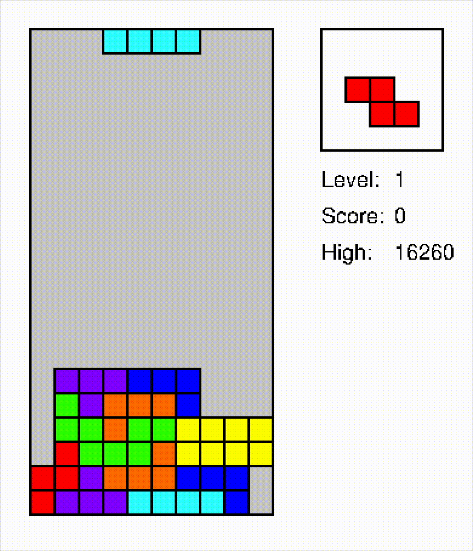

# PSTris
A Tetris implementation in PostScript

</src>

#### Motivation

- implement a realtime game in PostScript
- play it in GhostView on macOS

See also:

- [PSChess](https://github.com/nst/PSChess)
- [PSSokoban](https://github.com/nst/PSSokoban)
- [Programming in PostScript](https://seriot.ch/projects/programming_in_postscript.html)

### Features

- 600 lines or 10 KB of PostScript
- 69 different operators
- realtime input
- direct drop
- levels with increasing speed
- 7-tetriminos random bags
- high scores
- Nintendo scoring scheme

### Play Tetris in GhostView

Terminal window 1:

    $ gs -sNOSAFER tetris.ps

Terminal window 2:
    
    $ stty raw -echo; cat >> t.txt

Play with arrows and space bar in window 2.

### Notes and Limitations

Some implementation details inspired from [MeatFighter](https://meatfighter.com/nintendotetrisai/).

Tested with [GhostView on macOS](https://github.com/johnhcc/homebrew-gs-x11).
